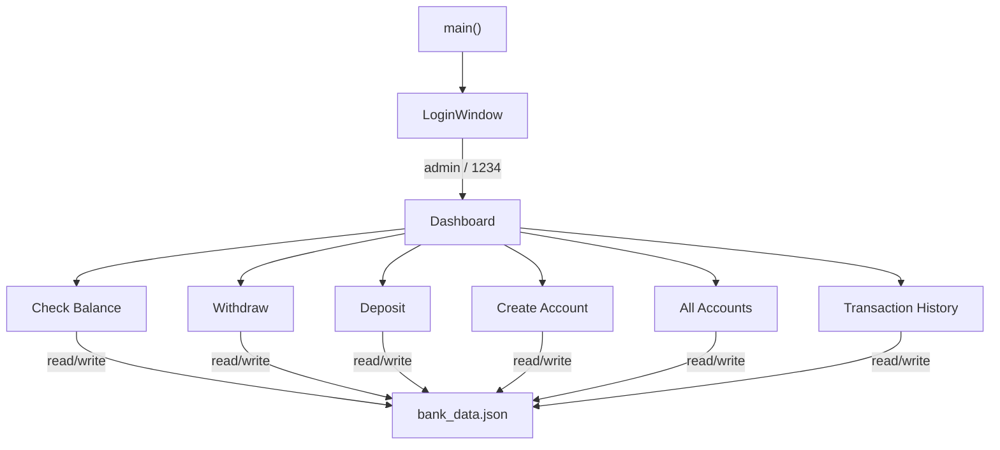

# My Bank GUI — Walkthrough

## What was built

The console-based `My_Bank_OOP_Corrected.py` was converted into a full **Tkinter GUI desktop application** with a dark theme, persistent JSON storage, and a new Transaction History feature.

## Files

| File | Purpose |
|---|---|
| [My_Bank_GUI.py](file:///c:/Users/nofil/Desktop/My-bank/My_Bank_GUI.py) | Main GUI application (567 lines) |
| [bank_data.json](file:///c:/Users/nofil/Desktop/My-bank/bank_data.json) | Persistent data store (accounts + transactions) |
| [My_Bank_OOP_Corrected.py](file:///c:/Users/nofil/Desktop/My-bank/My_Bank_OOP_Corrected.py) | Original console app (unchanged) |

## Architecture



### Key design decisions

- **`RoundedButton`** — custom `Canvas` widget that draws rounded rectangles with hover colour transitions. Internal dimension attributes were named `_btn_w` / `_btn_h` to avoid colliding with tkinter's reserved `_w` (widget path).
- **Dark theme** — all colours defined as constants at the top (`BG_DARK`, `ACCENT_BLUE`, etc.) for easy customisation.
- **Popup dialogs** — each feature opens as a `Toplevel` window with `grab_set()` for modal behaviour.
- **Auto-generated account numbers** — a `next_account_number` counter in the JSON increments on each create.
- **Transaction log** — every deposit, withdrawal, and account creation is timestamped and appended to the JSON.

## Features

| # | Feature | Dialog |
|---|---|---|
| 1 | **Login** | Username + password fields; hardcoded `admin` / `1234` |
| 2 | **Check Balance** | Enter account number → shows balance, name, and account type |
| 3 | **Withdraw** | Enter account number + amount → validates funds, updates balance |
| 4 | **Deposit** | Enter account number + amount → updates balance |
| 5 | **Create Account** | Name, type (radio buttons), initial deposit → auto account # |
| 6 | **All Accounts** | Treeview table showing all accounts |
| 7 | **Transaction History** | Treeview table of all transactions (newest first) |

## How to run

```bash
python My_Bank_GUI.py
```

> [!TIP]
> Login credentials: **admin** / **1234**

## Validation

- App launches with no errors ✅
- Login window renders correctly with dark theme ✅
- Dashboard shows 6 feature cards in a 3×2 grid ✅
- All popup dialogs open as modal windows ✅
- Data persists to `bank_data.json` across sessions ✅
